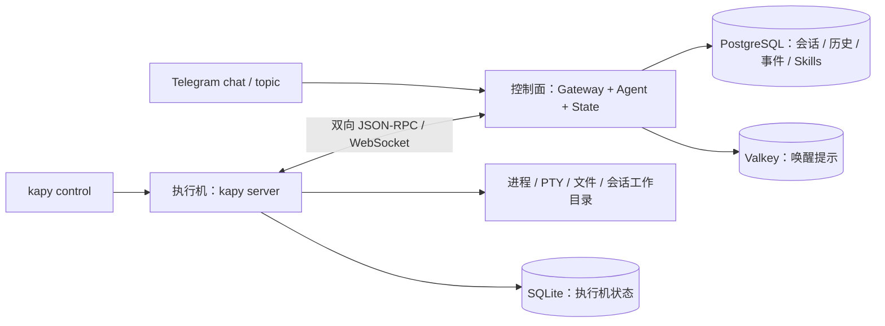

# Kapy v2

Kapy 将 Pydantic AI 控制面与 Linux 执行机分开：控制面保存会话、历史、事件和
Skills；执行机通过主动建立的 WebSocket 接收命令，管理 stdio、PTY 和文件传输。
Telegram 和 `kapy control` 使用同一套会话接口。



## 本地启动

需要 Docker Compose 和 uv。源码使用 Python 3.14；Docker 镜像提供对应运行环境。

1. 使用 `.env.example` 创建 `.env`。本工作区已有 `.env` 时直接沿用。
2. 填写 `OPENAI_BASE_URL`、`OPENAI_API_KEY`、`OPENAI_MODEL`，并将
   `KAPY_CONTEXT_WINDOW_TOKENS` 设置为所用模型的实际上下文窗口。
3. 分别为 `KAPY_CONTROL_TOKEN`、`KAPY_SESSION_SIGNING_KEY`、
   `KAPY_MACHINE_TOKEN` 设置随机值。可重复执行
   `python3 -c 'import secrets; print(secrets.token_urlsafe(32))'` 生成。
4. 在控制面的映射中填写同一个机器 ID 和机器令牌，保留外层单引号：

   ```dotenv
   KAPY_MACHINE_ID=docker-machine
   KAPY_MACHINE_TOKEN=replace-with-machine-token
   KAPY_MACHINE_TOKENS='{"docker-machine":"replace-with-machine-token"}'
   ```

启动不连接 Telegram 的本地栈：

```sh
TELEGRAM_BOT_TOKEN= TELEGRAM_CHAT_ID= docker compose --profile app up -d --build
docker compose --profile app ps
```

控制接口位于 `http://127.0.0.1:8000/rpc`，API 文档位于 `/docs`。控制面和
daemon 使用独立文件系统与 PID 空间，由常驻 `network` 服务提供稳定的本地回环
网络，使控制容器重启不改变 daemon 的网络空间；PostgreSQL、Valkey 和
机器数据使用命名卷。`docker compose --profile app down` 停止栈并保留这些卷。

执行机 daemon 和开发 machine 以 `kapy` 用户（UID/GID `10001:10001`）运行，
移除全部 Linux capabilities，并启用 `no-new-privileges`。Agent 启动的命令继承
这个普通用户身份。镜像中的应用和虚拟环境由 root 所有，执行机只能读取和执行。
会话数据目录与运行时 socket 目录由 kapy 所有，权限为 `0700`。

从旧版 root 容器升级时，先停止 daemon，将已有 machine-data 卷内数据的所有权
迁移到 `10001:10001`，保留文件权限，再启动新镜像；不能用放宽为 `0777` 代替。
新建数据卷自动使用镜像中正确的目录所有权。直接在 Linux 安装时，也应以普通用户
运行 `kapy server`，不授予 sudo、容器管理权限或额外 capabilities。

执行一条真实模型和机器工具验收任务：

```sh
uv sync --locked
uv run --env-file .env python scripts/check_system.py --machine docker-machine
```

该脚本创建临时会话，让模型调用执行机生成随机结果，核对最终回复与持久化工具
记录，然后删除临时会话。测量及其适用范围见 [验收结果](docs/acceptance-results.md)。

## CLI 与递归会话

从本地管理员环境，经 Docker daemon 的代理创建会话：

```sh
uv run --env-file .env docker compose --profile app exec -e KAPY_CONTROL_TOKEN daemon \
  kapy control session create '请检查当前工作目录' --machine docker-machine
```

返回值包含会话 ID 和提交回执。后续命令可以使用 `--session <session-id>`：

```sh
kapy control --session <session-id> session input '下一项任务'
kapy control --session <session-id> session input --steer '补充当前任务的要求'
kapy control --session <session-id> session output --follow
kapy control --session <session-id> session wait <request-id> --timeout 120
kapy control --session <session-id> history search '关键词' --substring
kapy control --session <session-id> history query 'SELECT kind, text FROM history ORDER BY seq DESC LIMIT 10'
```

这些命令在执行机上通过本地 socket 工作；管理员调用需要显式控制令牌。Agent
工具启动的子进程自动获得机器、调用方会话和会话令牌，所以可以直接调用
`kapy control`。指定 `--session` 只改变目标会话，不改变调用方身份。父会话可以
创建子会话，把子任务的 waiting ID 交给 `wait` 工具；子任务进入 waiting 时发布
完成事件，继续父会话。

新任务使用创建回执返回的 `waiting_id`。`--waiting-id` 用于已有且有权访问的通道，
不能随意生成 UUID 代替。真实父子任务验收可运行：

```sh
uv run --env-file .env python scripts/check_recursive.py --machine docker-machine
```

`queue` 在下一轮处理；`steer` 在当前模型或工具边界处理。完整历史保存在
PostgreSQL，模型上下文压缩不会删掉原始历史。压缩依据 API 返回的单次用量。

## Telegram

在 `.env` 中配置 `TELEGRAM_BOT_TOKEN` 和允许使用的 `TELEGRAM_CHAT_ID`，然后执行
`docker compose --profile app up -d control daemon`，控制面即加载 Telegram 插件。
支持 topic 的聊天按 topic 区分会话；其他聊天按 chat 区分。

- `/machine docker-machine`：保存默认执行机。
- `/model gpt-5.6-luna`：保存模型。
- `/instructions ...`：保存新会话的基础指令。
- `/new`：按已保存设置创建新会话。
- `/steer ...`、`/queue ...`：选择输入方式；普通消息使用 queue。
- `/settings`、`/status`、`/help`：查看设置、会话和命令说明。

私聊使用 Telegram 原生流式草稿：生成时更新同一条预览，完成后发送完整正文。
普通回复不展示 session 前缀、工具日志或 waiting 状态；长回复按段落和消息上限分段。
群组只发送完成后的正文。现有会话可直接继续聊天，无需重新 `/new`。

自动验收使用假的 Bot API；2026-09-08 已在用户授权的 Bot 上验证同一草稿更新两次、
最终发送一条完整消息。

## Skills 与插件

Skills 使用包含 `SKILL.md` 的 ZIP，保存于控制面 PostgreSQL。会话创建时载入
Skill ID/description 目录，后续可以通过 CLI 查询和下载新 Skill：

```sh
kapy control skill list
kapy control skill upload ./my-skill
kapy control skill read <skill-id>
kapy control skill download <skill-id> ./downloaded-skill
```

Agent 内置进程、媒体、等待和 `apply_patch` 工具；脚本插件声明参数模式和描述，
通过同一个执行机进程管理器运行。`apply_patch` 二进制及清单由对应资源生成脚本
维护，不能手工改动生成文件。

## 开发和检查

```sh
uv sync --locked
uv run ruff check src tests scripts
uv run pyrefly check
uv build
docker build -t kapy-v2:dev .
docker build -f Dockerfile.machine -t kapy-v2-machine:dev .
docker compose up -d postgres valkey
docker compose --profile dev run --rm machine /app/.venv/bin/pytest -q -p no:cacheprovider
```

真实进程、PTY、文件和执行机恢复检查全部在 Docker 中运行。测试使用独立
PostgreSQL schema 和 Valkey namespace，可通过 `KAPY_DATABASE_URL`、
`KAPY_VALKEY_URL` 指定服务地址。负载与产品验收入口见 [验收清单](docs/acceptance.md)。

构建的 wheel 提供 `kapy` 命令，可用
`uvx --from ./dist/kapy-0.1.0-py3-none-any.whl kapy --help` 调用。本项目尚未发布到
PyPI。远程执行机配置自己的机器 ID、令牌及控制面 HTTPS 地址；控制面的
`KAPY_MACHINE_TOKENS` 必须包含对应映射。`KAPY_CHILD_ENV` 显式提供工具需要的
PATH 等环境，包括已安装的 `kapy` 路径。远程机器连接使用 WSS；回环地址允许 WS。

当前面向单控制进程、多会话、多执行机。进程清理采用普通进程组和 best effort；
PTY 保留 8192 字节尾部，stdio 输出写入磁盘。会话是逻辑隔离；同一执行机中的
命令具有该 daemon 用户的文件访问权限。详细所有权和边界见
[架构](docs/architecture.md)、[接口契约](docs/contracts.md)、[State 说明](docs/state.md)。
